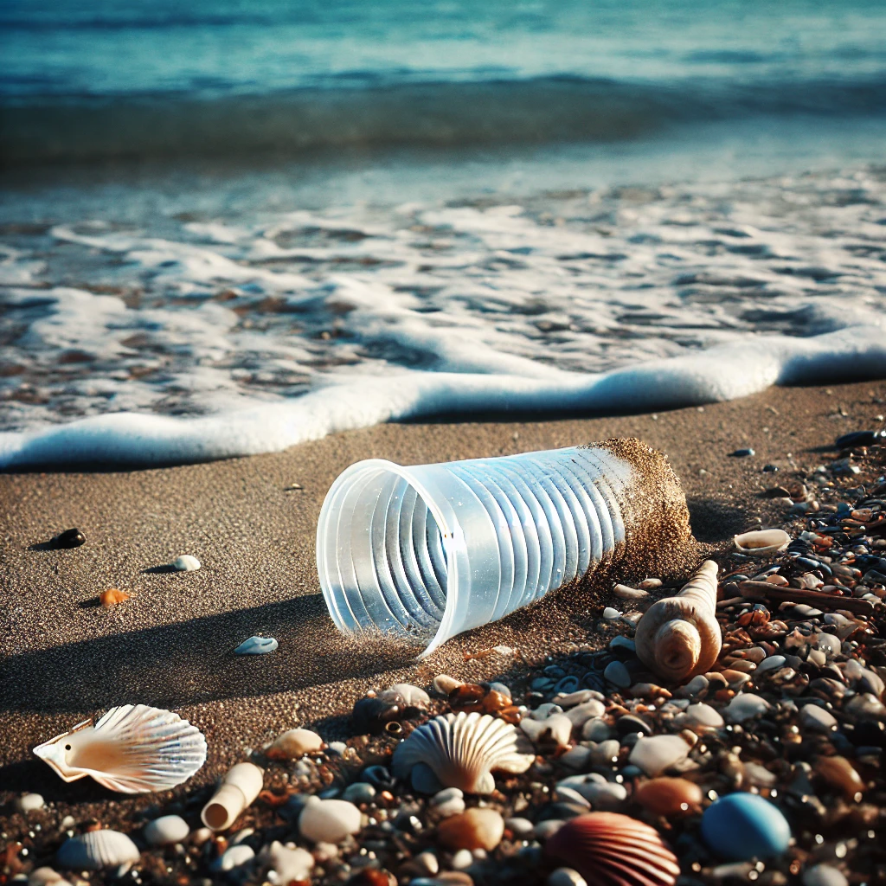

# Recycle-AR: Escape Room de Realidad Aumentada para Aprender a Reciclar


## Índice
- [Descripción del Proyecto](#descripción-del-proyecto)
- [Resumen General](#resumen-general)
- [Franja de Edad Seleccionada](#franja-de-edad-seleccionada)
- [Objetivo de Aprendizaje](#objetivo-de-aprendizaje)
- [Frameworks Utilizados](#frameworks-utilizados)
- [QR para la aplicación](#qr-para-la-aplicación)
- [Imágenes para escanear dentro de la aplicación](#imágenes-para-escanear-dentro-de-la-aplicación)
- [Guía de Instalación de Recycle-AR](#guía-de-instalación-de-recycle-ar)
  - [1. Clonar el Repositorio](#1-clonar-el-repositorio)
  - [2. Abrir el Proyecto en Unity](#2-abrir-el-proyecto-en-unity)
  - [3. Configurar Vuforia](#3-configurar-vuforia)
  - [4. Configurar la Licencia de Vuforia](#4-configurar-la-licencia-de-vuforia)
  - [5. Ejecutar el Proyecto](#5-ejecutar-el-proyecto)


## Descripción del Proyecto
Recycle-AR es un proyecto de aprendizaje interactivo en formato de Escape Room en Realidad Aumentada (AR), diseñado para enseñar a las personas a reciclar correctamente a través de experiencias inmersivas y dinámicas. A través de la cámara del móvil, los usuarios escanean imágenes de distintos objetos y deciden en qué contenedor deben ser depositados. Cada decisión correcta les otorga puntos, incentivando el aprendizaje sobre el reciclaje y fomentando una actitud de respeto hacia el medio ambiente.

## Resumen General
El proyecto se centra en ofrecer una experiencia innovadora que combina educación y entretenimiento para enseñar de manera práctica y entretenida la importancia del reciclaje. Los usuarios se enfrentan a retos que requieren su participación activa para resolverlos correctamente, haciendo que el proceso de aprendizaje sea más memorable y efectivo.

## Franja de Edad Seleccionada
Recycle-AR está diseñado para personas de entre 5 y 10 años, un grupo que incluye tanto adolescentes como jóvenes adultos. Este rango de edad es ideal para fomentar el aprendizaje sobre temas de reciclaje y cuidado ambiental, ya que son edades clave en la formación de hábitos sostenibles y conciencia ecológica.

## Objetivo de Aprendizaje
El objetivo principal de Recycle-AR es promover el reciclaje y ayudar a los usuarios a identificar el contenedor adecuado para cada tipo de residuo. El proyecto busca incentivar un cambio positivo en los hábitos de desecho de los usuarios, enseñándoles la importancia de separar correctamente los residuos y contribuyendo a un entorno más limpio y sostenible.


## Frameworks Utilizados
Para el desarrollo de Recycle-AR se han utilizado los siguientes frameworks y herramientas:

- **Unity 2022.3.49f1**: Utilizado como motor de desarrollo principal para la creación de la experiencia interactiva en AR.
- **Vuforia**: Implementado para la integración de la funcionalidad de realidad aumentada, permitiendo el reconocimiento de imágenes y objetos para una interacción fluida y precisa con el entorno.

# QR para la aplicación
<div style="text-align: center;">
  
</div>

# Imágenes para escanear dentro de la aplicación
<div style="text-align: center;">
  
  
  
  
  
</div>

# Guía de Instalación de Recycle-AR

Sigue los siguientes pasos para clonar e instalar Recycle-AR en tu entorno de desarrollo local:

## 1. Clonar el Repositorio
1. Abre tu terminal o línea de comandos.
2. Ejecuta el siguiente comando para clonar el repositorio:
   ```bash
   git clone https://github.com/JavierPadronGarcia/recycle-ar.git
3. Accede al directorio del proyecto:
   ```bash
   cd recycle-ar

## 2. Abrir el Proyecto en Unity
1. Abre **Unity Hub**.
2. Haz clic en **Add** y selecciona la carpeta del proyecto que acabas de clonar.
3. Asegúrate de que tienes instalada la versión de **Unity 2022.3.49f1**. Si no la tienes, descárgala e instálala desde Unity Hub.

## 3. Configurar Vuforia
1. Ve al menú **Window** > **Package Manager** en Unity.
2. Busca y agrega el paquete de **Vuforia**. Si Vuforia no aparece en la lista, sigue estos pasos:
   - Ve a la página de [descarga de Vuforia](https://developer.vuforia.com/downloads/sdk).
   - Descarga la versión más reciente del SDK de Vuforia para Unity.
   - Importa el paquete de Vuforia a tu proyecto de Unity usando **Assets** > **Import Package** > **Custom Package**.
3. Acepta los términos de uso y sigue los pasos de instalación.

## 4. Configurar la Licencia de Vuforia
1. Crea una cuenta en [Vuforia Developer Portal](https://developer.vuforia.com/).
2. Genera una nueva clave de licencia y copia el valor.
3. En Unity, ve a **Window** > **Vuforia Configuration** y pega tu clave de licencia en el campo correspondiente.

## 5. Ejecutar el Proyecto
1. Asegúrate de que tu cámara web o dispositivo móvil esté conectado.
2. Haz clic en **Play** en el editor de Unity para ejecutar el proyecto y comenzar a interactuar con Recycle-AR.

¡Ya estás listo para usar Recycle-AR y explorar sus funcionalidades de realidad aumentada!
